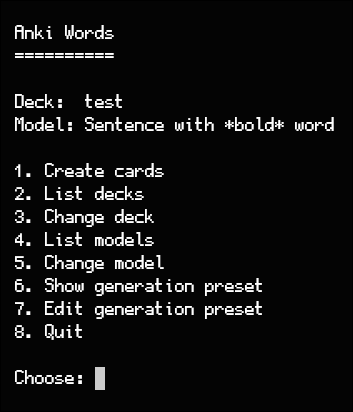

# Anki Words TUI



Terminal app for creating English vocabulary notes in Anki. Enter words, choose an Anki deck/model, and the app asks an OpenAI-compatible API to generate fields for that note model.

## Requirements

- Anki Desktop
- [AnkiConnect](https://ankiweb.net/shared/info/2055492159) add-on
- OpenAI API key, or another OpenAI-compatible API
- Go 1.23+

## Quick Start

1. Start Anki Desktop.
2. Install and enable AnkiConnect.
3. Create your local env file:

```bash
cp .env.example .env
```

4. Edit `.env` and set at least:

```env
OPENAI_API_KEY=your_api_key
ANKICONNECT_URL=http://127.0.0.1:8765
```

5. Run the app:

```bash
make run
```

## AnkiConnect Check

If the app cannot read decks or models, verify AnkiConnect from your terminal:

```bash
curl -X POST http://127.0.0.1:8765 \
  -H 'Content-Type: application/json' \
  -d '{"action":"version","version":6}'
```

Expected response:

```json
{"result": 6, "error": null}
```

## Configuration

Common variables in `.env`:

| Variable | Default | Description |
| --- | --- | --- |
| `OPENAI_API_KEY` | required | API key for card generation. |
| `OPENAI_BASE_URL` | `https://api.openai.com/v1` | OpenAI-compatible API base URL. |
| `OPENAI_MODEL` | `gpt-5.4-mini` | Model used for generation. |
| `ANKICONNECT_URL` | required | AnkiConnect endpoint. |
| `SETTINGS_FILE` | `./out/settings/settings.json` | Saved deck, model, and preset. |
| `SENTENCE_HIGHLIGHT_COLOR` | `#00557f` | Color for highlighted target words. |
| `LOGGER_LEVEL` | `INFO` | `DEBUG`, `INFO`, `WARN`, or `ERROR`. |
| `LOGGER_FOLDER` | `./out/logs` | Log output directory. |

## Usage

The app starts with the first deck and note model returned by Anki. Change them from the menu before creating cards if needed.

Menu:

```text
1. Create cards
2. List decks
3. Change deck
4. List models
5. Change model
6. Show generation preset
7. Edit generation preset
8. Quit
```

When creating cards, enter comma-separated words:

```text
apple, concise, wander
```

The selected Anki note model controls which fields are generated. Simple models such as `Front`/`Back` work, and richer vocabulary models such as `Word`/`Sentence`/`Translation` work too.

If the model has a `Sentence` field, the generated sentence must include the highlighted target word:

```html
<span style="color:#00557f;"><b>WORD</b></span>
```

## Local Files

- Settings: `out/settings/settings.json`
- Logs: `out/logs`
- Example screenshot: `assets/app.png`
